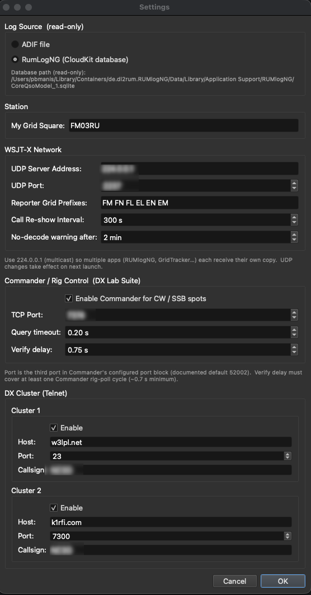

Configuration Reference
=======================

DX Spotter stores its configuration in a TOML file.  The file is created
automatically the first time you quit the application.

Settings dialog
---------------

The **Settings** button in the main window opens a modal dialog for settings
that do not fit naturally into the parameter tree.

Log Source section
~~~~~~~~~~~~~~~~~~

Choose between two log backends:

* **ADIF file** — browse to an ADIF export (``*.adif`` or ``*.adi``).  The
  file is parsed once on load and re-parsed when you change the path.
* **RumLogNG (CloudKit database)** — available only on macOS when the
  RumLogNG application has been run at least once.  The database is opened
  read-only; DX Spotter never writes to it.

Station section
~~~~~~~~~~~~~~~

* **My Grid Square** — your Maidenhead locator.  Accepts up to six characters
  (e.g. ``FN31pr``).  Used for distance calculations and the WSJT-X range
  filter.

WSJT-X Network section
~~~~~~~~~~~~~~~~~~~~~~~

* **UDP Server Address** — multicast or unicast address.  Recommended:
  ``224.0.0.1`` (multicast).  Must match WSJT-X Settings → Reporting.
* **UDP Port** — port number (default ``2237``).  Must match WSJT-X.
* **Reporter Grid Prefixes** — space-separated list of two-character
  Maidenhead prefixes (e.g. ``FM FN FL EL EN EM``).  Leave blank to accept
  reports from all reporters worldwide.
* **Call Re-show Interval** — seconds before the same WSJT-X callsign can
  appear again in the spot table (default ``300``).  Set to ``0`` to
  disable.
* **No-decode warning after** — minutes of silence (no WSJT-X decode
  packets) before the WSJT-X status indicator turns yellow (default ``2``).

Rig Control section
~~~~~~~~~~~~~~~~~~~

* **Enable Commander** — when checked, double-clicking any spot QSYs the
  radio via DX Lab Suite Commander.
* **Commander Host** — hostname or IP of the Commander process
  (default ``127.0.0.1``).
* **Commander Port** — TCP port Commander listens on (default ``52002``).

DX Cluster section (T1 / T2)
~~~~~~~~~~~~~~~~~~~~~~~~~~~~~

Two independent DX Cluster connections (labelled **T1** and **T2**) can be
configured.  For each cluster:

* **Enable** — check to connect on launch or immediately after clicking
  **OK** (no restart required).
* **Host** — hostname or IP of the DX Cluster node.
* **Port** — TCP port (common values: ``7300``, ``23``).
* **Callsign** — your callsign, used as the login credential.

Connection status for T1 and T2 is shown in the status bar: green when
connected, orange while connecting or reconnecting, grey when disabled.

.. note::

   UDP network changes (WSJT-X address/port) take effect on the next
   application launch.  All other settings dialog changes — including DX
   Cluster enable/disable, host, and port — take effect immediately when
   you click **OK**.

File location
-------------

==========  ================================================================
Platform    Path
==========  ================================================================
macOS       ``~/Library/Application Support/DXSpotter/config.toml``
Windows     ``%APPDATA%\\DXSpotter\\config.toml``
Linux       ``$XDG_CONFIG_HOME/dxspotter/config.toml``
            (falls back to ``~/.config/dxspotter/config.toml``)
==========  ================================================================

The file is plain text and safe to edit by hand.  Unknown keys are silently
ignored; missing keys fall back to the defaults listed below.

TOML key reference
------------------

[network]
~~~~~~~~~

.. option:: udp_address = "224.0.0.1"

   UDP multicast address that WSJT-X broadcasts to.  The default
   ``224.0.0.1`` is the WSJT-X standard multicast group.  Using multicast
   means DX Spotter, RUMlogNG, GridTracker, and JTAlert can all receive their
   own independent copy of every packet even when they are bound to the same
   port.

   Set the same value in WSJT-X Settings → Reporting → UDP Server Address.

.. option:: udp_port = 2237

   UDP port number.  Must match WSJT-X Settings → Reporting → UDP Server Port.

[adif]
~~~~~~

.. option:: log_source = "adif"

   Which contact log backend to use.  Valid values:

   * ``"adif"`` — load from a plain-text ADIF export file (``adif_path``).
   * ``"rumlogng"`` — load from the RumLogNG CloudKit SQLite database (macOS
     only; the database is opened read-only and is never modified).

.. option:: path = ""

   Filesystem path to the ADIF log file.  Only used when
   ``log_source = "adif"``.  Ignored for RumLogNG.

   Example: ``path = "/Users/alice/Documents/log.adif"``

[filters]
~~~~~~~~~

.. option:: my_grid = "FM05kw"

   Operator's six-character Maidenhead grid square (e.g. ``"FM05kw"``).
   Used to compute the distance from your QTH to each DX station and to each
   PSK Reporter reporting station.  Change this to your own grid square.

.. option:: band = "10m"

   Active band filter.  One of: ``"2m"``, ``"6m"``, ``"10m"``, ``"15m"``,
   ``"17m"``, ``"20m"``, ``"30m"``, ``"40m"``, ``"80m"``, ``"160m"``.

.. option:: mode = "FC"

   Active mode filter.  See the :option:`-m` CLI option for valid values and
   their meanings.

.. option:: decode_filter = "CQ"

   WSJT-X decode filter.  One of ``"CQ"``, ``"all"``, ``"me"``.

.. option:: max_range = 0

   Maximum distance in km from your grid to the PSK Reporter reporting
   station.  ``0`` means no range limit (show spots from all reporters).

.. option:: max_spot_age = 30

   Remove spot-table rows older than this many minutes.  ``0`` keeps spots
   indefinitely.

.. option:: wsjt_enabled = true

   Whether to start the WSJT-X UDP listener when the application launches.

.. option:: wsjt_port = 2237

   UDP port to listen on for WSJT-X packets.

.. option:: rx_grid_prefixes = ["FM", "FN", "FL", "EL", "EN", "EM"]

   List of two-character Maidenhead grid prefixes used to restrict PSK
   Reporter spots to those reported by stations in the operator's region.
   Only spots whose reporter grid square starts with one of these prefixes
   are displayed.  An empty list (``[]``) disables the filter and accepts
   spots from reporters anywhere in the world.

   This setting is also editable via the **Reporter Grid Prefixes** field in
   the Settings dialog.

.. option:: wsjt_reshow_secs = 300

   Minimum number of seconds between successive spot-table entries for the
   same callsign from WSJT-X.  A callsign heard again within this window is
   silently dropped from the table (though its decode is still cached for
   Reply).  Set to ``0`` to disable rate-limiting entirely.

   This setting is also editable via the **Call Re-show Interval** spinner
   in the Settings dialog.

.. option:: wsjt_no_spot_mins = 2

   Number of minutes without any WSJT-X decode packets before the WSJT-X
   status indicator turns yellow.  The indicator is green when decodes are
   arriving, yellow when the connection is alive but nothing is being heard,
   and red when the heartbeat itself stops.  Default is ``2`` minutes.

   This setting is also editable via the **No-decode warning after** spinner
   in the Settings dialog.

[ui]
~~~~

.. option:: criterion = "mixed"

   DXCC award criterion used to color the QSL column.  One of:

   =========== ============================================
   Value       Award
   =========== ============================================
   ``5bd``     5-Band DXCC (80 / 40 / 20 / 15 / 10 m)
   ``cw``      DXCC CW
   ``mixed``   DXCC Mixed (any mode confirmed, default)
   ``digital`` DXCC Digital
   ``ssb``     DXCC SSB
   ``6m``      DXCC 6M
   =========== ============================================

.. option:: display_filter = "all"

   Row visibility filter.  One of:

   =============== =================================================
   Value           Effect
   =============== =================================================
   ``all``         Show all spots (default).
   ``dxcc_only``   Hide spots for mainland US (DXCC 291) and Canada
                   (DXCC 1).
   ``unconfirmed`` Hide spots for DXCC entities already confirmed
                   under the active criterion.
   =============== =================================================

[rig]
~~~~~

.. option:: commander_enabled = false

   Set to ``true`` to enable DX Lab Commander rig control.  When enabled,
   double-clicking a spot commands the radio to the spot's frequency and mode
   via Commander.

.. option:: commander_host = "127.0.0.1"

   Hostname or IP address of the Commander process.  Almost always
   ``"127.0.0.1"`` (same machine as DX Spotter).

.. option:: commander_port = 52002

   TCP port Commander listens on.  Check Commander's configuration panel for
   the correct value; ``52002`` is the documented default.

.. option:: commander_timeout = 0.2

   TCP connection timeout in seconds for each Commander command.

.. option:: commander_verify_delay = 0.75

   Seconds to wait after sending a frequency/mode command before reading back
   the rig state to verify the command succeeded.  Should cover at least one
   Commander rig-poll cycle.

[telnet.cluster1] / [telnet.cluster2]
~~~~~~~~~~~~~~~~~~~~~~~~~~~~~~~~~~~~~~

Up to two DX Cluster connections can be configured.  Both sub-tables use the
same four keys.

.. option:: enabled = false

   Set to ``true`` to connect to this cluster on startup.  Changes in the
   Settings dialog take effect immediately — no restart is needed.

.. option:: host = ""

   Hostname or IP address of the DX Cluster node (e.g.
   ``"dxc.w3lpl.net"``).

.. option:: port = 7300

   TCP port of the DX Cluster node.  Common values are ``7300`` and
   ``23``.

.. option:: callsign = ""

   Your callsign, sent to the cluster as the login credential.

Example config.toml
-------------------

.. code-block:: toml

   # DXSpotter configuration — safe to edit by hand.

   [network]
   udp_address = "224.0.0.1"
   udp_port    = 2237

   [adif]
   log_source = "adif"
   path       = "/Users/alice/Documents/log.adif"

   [filters]
   my_grid            = "FN31pr"
   band               = "20m"
   mode               = "FT8"
   decode_filter      = "CQ"
   max_range          = 3000
   max_spot_age       = 30
   wsjt_enabled       = true
   wsjt_port          = 2237
   rx_grid_prefixes   = ["FM", "FN", "FL", "EL", "EN", "EM"]
   wsjt_reshow_secs   = 300
   wsjt_no_spot_mins  = 2

   [ui]
   criterion      = "mixed"
   display_filter = "all"

   [rig]
   commander_enabled      = true
   commander_host         = "127.0.0.1"
   commander_port         = 52002
   commander_timeout      = 0.2
   commander_verify_delay = 0.75

   [telnet.cluster1]
   enabled  = true
   host     = "dxc.w3lpl.net"
   port     = 7300
   callsign = "W1XYZ"

   [telnet.cluster2]
   enabled  = false
   host     = ""
   port     = 7300
   callsign = ""
