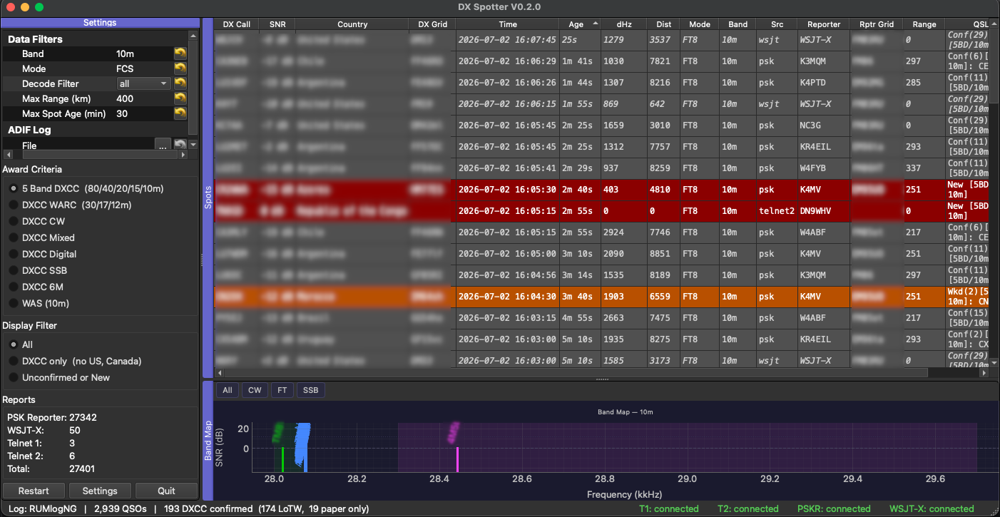

DX Spotter Documentation
========================

DX Spotter is a desktop application for amateur radio operators that can combine spots from multiple sources,
connect to WSJT-X, PSK reporter, and telnet clusters,
and display the spots in a table and bandmap format. The program can also compare the spots against an ADIF log or RumLogNG log to determine which DXCC entities have been worked or confirmed on the current band, and color the table accordingly. The program is designed to be extensible to other sources of spots and other award criteria.

The project is licensed under the MIT License.

.. toctree::
   :maxdepth: 2
   :caption: User Guide
   :hidden:

   usage
   configuration
   display

.. toctree::
   :maxdepth: 2
   :caption: API Reference
   :hidden:

   api/adif_log
   api/appconfig
   api/band_map
   api/commander_client
   api/dxspotter
   api/main_window
   api/mqtt_listener
   api/settings_dialog
   api/spot_window
   api/telnet_cluster
   api/wsjtx_listener

.. toctree::
   :maxdepth: 1
   :caption: Reference
   :hidden:

   source_layout

Overview
--------

Spots are presented in a table format, and a bandmap formt. The program provides several filters to make it easier
to identify useful spots, including limiting spots to the current band for the radio in use, different combinations
of modes, whether stations are calling CQ or are just spotted, whether the spotter is within a specific distance
of the receiving station, or in specific grid squares, and by spot age (time since last heard or spotted).

The program can access an ADIF formatted log, or, in MacOS, RumLogNG's current log. Spots are then evaluated
relative to selected award criterion (currently DXCC and WAS for one band). A tally of reports is available.

The table can be sorted by any column, and is colored according to whether the DX entitiy has been worked or confirmed
on the current band (or other bands, depending on the award critera). In the table,
double-clicking on a digital mode spot will send a command to WSJT-X to set up to work the station on that mode.
Clicking on other spots (CW or SSB) will set the radio to the frequency and mode of the spot via DX Lab Commander.

The band map shows the spots on a frequency scale, filtered in the same way as the table.
The band map can also be used to set the radio frequency and mode by clicking on a spot via DX Lab Commander.

The application
was created because I wanted spots to be partly based on the physical proximity of the receiving station
to my location, or to be calls heard by WSJT-X,  which by definition, were heard by my station. I also wanted to
be able to compare the spots against my log to find new countries in individual bands and modes, or for
combinations of bands and modes, with a separate treatment for 6m.

PSK spots are handled by code originally forked from Petr Kracik (OK1RP) to handle MQTT data from PSK Reporter.
The concept to extend this to also take input from WSJT-X and its
derivaties, to create a GUI wrapper to generate the table and selection criteria, and to confirm that
what is displayed is useful, hopefully correct, and general, was from Paul Manis (NC3G).
The main application code was generated by an iterative set of instructions to Claude Sonnet 4.6 as
an experimental "pair coding" effort to debug the generated code.

The program structure is designed to
be extensible to other sources of spots through modular components, and to other award criteria.

A settings panel allows the user to select the log sources. For WSJT-X sources,
the settings for the the UDP server address and port for WSJT-X are avaialble, and
filters include
the grid square of the receiving station, a call reshow interval, reporter grid prefixes, and the time
before a "no-decode" warning is displayed. Rig control settings include the TCP port, a query time out and
the delay to verify that the command to the radio was successful. The PSK connectiion is currently hard-coded.
Up to 2 telnet clusters can be configured by host, port and the login (usually the callsign).
The settings are saved in a TOML file in the user's home directory so that they persist across sessions.

Each incoming spot is:

1. Looked up in a callsign database (pyhamtools / cty.plist) to resolve the
   country name and ADIF DXCC entity number (this is sometimes incorrect, for example
   as KG4XXX being in Guantanamo Bay, Cuba, rather than correctly in Florida).
2. Compared against the operator's ADIF or RumLogNG contact log to determine
   the award status for the active criterion.
3. Inserted into the spot table and the band map with a color reflecting the award
   status and mode.

Navigation
----------

DX Spotter uses pyqtgraph (www.pyqtgraph.org), a Qt-based plotting library for Python. The left column should operate intuitively,
with the label identifying the parameter, and the field providing a control to set the parameter (text entry, drop-down list). The 
yellow curved arrow resets the parameter to its default value. The Award Criteria and Display Filter use radio
buttons to select one of several options. 

The table and bandmap are on the right side of the window, using pyqtgraph's "docking" system. The docks (labeled "Spots"
and "Band Map") can be move, resized, or even torn off. Control of the position can be tricky until you learn
that there are highlighted areas on the top and bottom of the dock that can be used to move the dock.

The band map can be resized relative to the spot table by dragging the horizontal bar between the two docks.

Scaling of the spot map uses pyqtgraph's "ViewBox" system, which allows the user to zoom in and out of the band map by dragging a rectangle with the mouse, or by using the mouse wheel. The user can also pan the view by clicking and dragging with the right mouse button.
With the mouse pointing within the x-axis, scrolling the mouse wheel will zoom the axis in and out around the
current position. The y-axis is locked. If you scroll, there is also a boxed letter "A" that appears in the lower
left corner of the band map dock. Clicking on this will reset the zoom to the default view. Above the map are 4 buttons
that can be used to expand the map to specific subbands, or to reset the zoom to the default view.

Quick start
-----------

* From the command line:
.. code-block:: bash

   # Install
   pip install -e .

   # Run (macOS / Linux)
   dxspotter --call W1XYZ --band 20m --mode FT8

   # Run with WSJT-X listener
   dxspotter --call W1XYZ --band 20m --mode FC --wsjt

   # run using a preexisting configuration file:
   dxspotter

   For MacOS, an app bundle can also be generated, and started from the Applications folder.

See :doc:`usage` for full installation instructions and command-line options.

* from the local git repository:

   .. code-block:: bash

      # Clone the repository
      git clone https://github.com/yourusername/dx-spotter.git
      cd dx-spotter
      # Install
      pip install -e .
      or:
      uv install -e .
      python src/dxspotter.py

Indices and tables
------------------

* :ref:`genindex`
* :ref:`modindex`
* :ref:`search`
